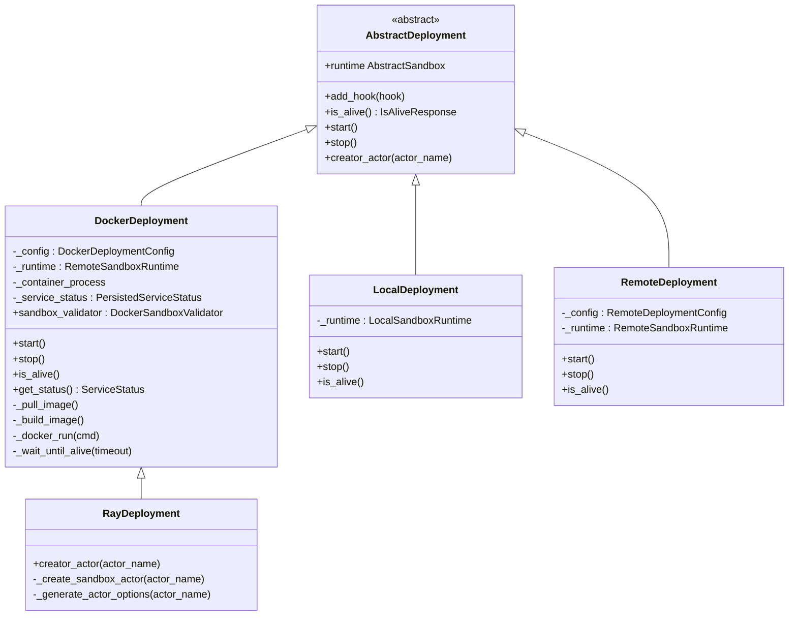
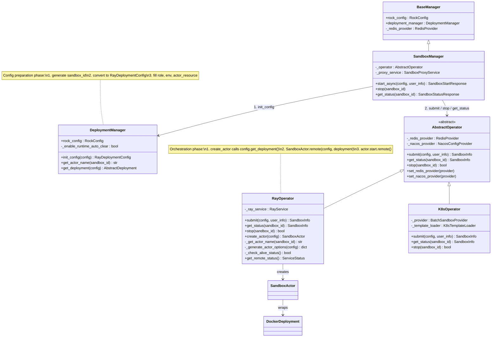
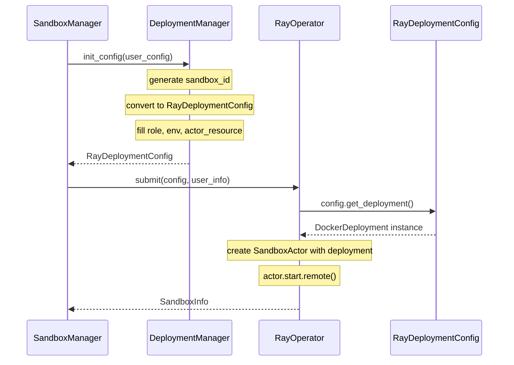
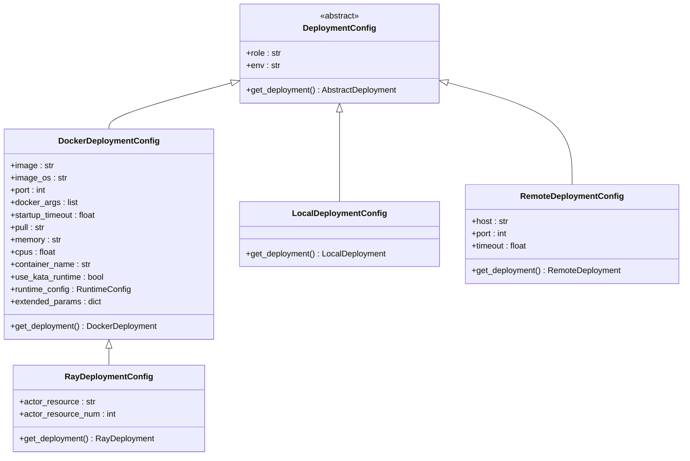
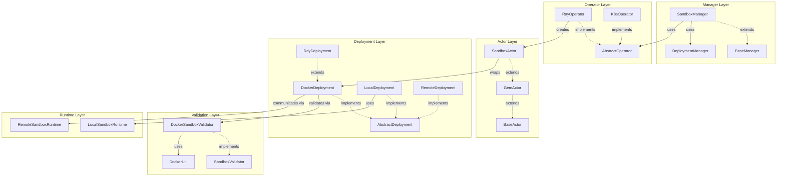
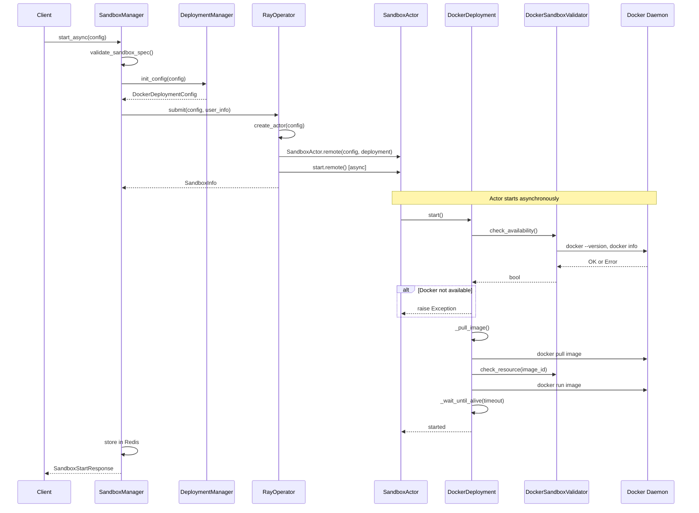
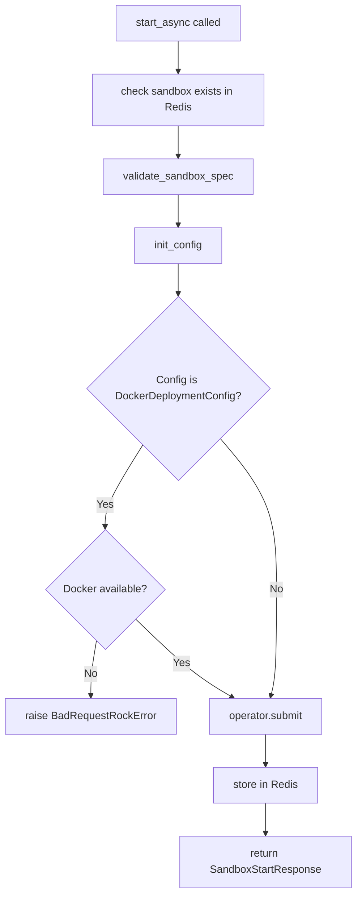

# Deployment Architecture

## 1. Overall Architecture

### 1.1 Class Hierarchy & Operator Design

#### Deployment Classes



#### Operator & DeploymentManager

`DeploymentManager` 和 `Operator` 分工协作，由 `SandboxManager` 协调调用：

- **DeploymentManager** — 负责 **Config 准备阶段**：接收用户原始 `DeploymentConfig`，统一转换为 `RayDeploymentConfig`，生成 sandbox_id，填充 role/env/actor_resource 等默认值。
- **Operator** — 负责 **部署编排阶段**：接收准备好的 Config，创建 Actor / Pod，管理生命周期（start、get_status、stop）。`RayOperator` 内部通过 `config.get_deployment()` 创建 `DockerDeployment` 实例。

> **注意**：`DeploymentManager.get_actor_name()` 和 `RayOperator._get_actor_name()` 存在重复逻辑（均为 `f"sandbox-{sandbox_id}"`），`SandboxManager` 在非 Operator 路径（如 `get_sandbox_statistics`、`get_mount`）中直接调用 `DeploymentManager.get_actor_name()`。



调用流程：



### 1.2 Configuration Hierarchy



### 1.3 Sandbox Manager & Operator Architecture



### 1.4 Sandbox Startup Flow (via RayOperator)



## 2. Docker Usage Analysis

### 2.1 Docker Dependency Points

Docker is used in the following scenarios:

| Component | Method | Docker Operation |
|-----------|--------|------------------|
| `DockerDeployment.start()` | `sandbox_validator.check_availability()` | `docker --version` + `docker info` |
| `DockerDeployment._pull_image()` | `DockerUtil.pull_image()` | `docker pull {image}` |
| `DockerDeployment._build_image()` | subprocess | `docker build` |
| `DockerDeployment.start()` | `sandbox_validator.check_resource()` | `docker inspect {image}` |
| `DockerDeployment.start()` | `_docker_run()` | `docker run ...` |
| `DockerDeployment._stop()` | subprocess | `docker kill {container}` |
| `DockerDeployment._stop()` | `DockerUtil.remove_image()` | `docker rmi {image}` |

### 2.2 Current Docker Validation

Docker availability is currently validated **only inside `DockerDeployment.start()`** (line 290 of `docker.py`):

```python
async def start(self):
    if not self.sandbox_validator.check_availability():
        raise Exception("Docker is not available")
```

This means Docker unavailability is only detected **after** the sandbox actor has been created and submitted to Ray, which wastes resources and makes the error harder to trace.

### 2.3 Current Test Markers

- `need_ray` - registered in `pyproject.toml`, used to mark tests requiring Ray cluster
- `SKIP_IF_NO_DOCKER` - defined in `tests/integration/conftest.py`, used via `skipif` for integration tests
- **No `need_docker` marker** exists for unit tests

## 3. Proposal: `need_docker` Test Marker

### 3.1 Problem

`test_get_status` and similar tests in `tests/unit/sandbox/test_sandbox_manager.py` use `DockerDeploymentConfig`, which ultimately calls `DockerDeployment.start()`. When Docker is not installed or daemon is not running, these tests fail with an unclear error instead of being skipped.

Tests using Docker:
- `test_async_sandbox_start` - uses `DockerDeploymentConfig()`
- `test_get_status` - uses `DockerDeploymentConfig(image="python:3.11")`
- `test_ray_actor_is_alive` - uses `DockerDeploymentConfig()`
- `test_resource_limit_exception` - uses `docker_deployment_config` fixture
- `test_resource_limit_exception_memory` - uses `docker_deployment_config` fixture
- `test_get_status_state` - uses `DockerDeploymentConfig(cpus=0.5, memory="1g")`
- `test_sandbox_start_with_sandbox_id` - uses `DockerDeploymentConfig(...)`

### 3.2 Solution

#### Step 1: Register `need_docker` marker in `pyproject.toml`

```toml
markers = [
    "slow: marks tests as slow",
    "integration: marks tests as integration tests",
    "need_ray: need ray start",
    "need_docker: need docker daemon running",
    "need_admin: need admin start",
    "need_admin_and_network: need install from network"
]
```

#### Step 2: Add auto-skip logic in `tests/unit/conftest.py`

```python
from rock.utils.docker import DockerUtil

def pytest_collection_modifyitems(config, items):
    if not DockerUtil.is_docker_available():
        skip_docker = pytest.mark.skip(reason="Docker is not available")
        for item in items:
            if "need_docker" in item.keywords:
                item.add_marker(skip_docker)
```

#### Step 3: Mark Docker-dependent tests

Add `@pytest.mark.need_docker` to all test cases that use `DockerDeploymentConfig`:

```python
@pytest.mark.need_ray
@pytest.mark.need_docker
@pytest.mark.asyncio
async def test_get_status(sandbox_manager):
    ...
```

## 4. Proposal: Early Docker Validation in SandboxManager

### 4.1 Problem

Currently Docker availability is only checked inside `DockerDeployment.start()`, which is called asynchronously inside the Ray actor. This means:

1. A Ray actor is allocated (consuming CPU/memory resources)
2. The actor starts, calls `deployment.start()`
3. Docker check fails, the actor throws an exception
4. Resources are wasted and error is hard to trace

### 4.2 Solution: Pre-validate in `SandboxManager.start_async()`

Add Docker availability check in `SandboxManager.start_async()` **before** submitting to the operator, specifically after `validate_sandbox_spec()` and before `self._operator.submit()`.



#### Implementation Location

In `rock/sandbox/sandbox_manager.py`, method `start_async()`, add validation between `init_config()` and `_operator.submit()`:

```python
@monitor_sandbox_operation()
async def start_async(
    self, config: DeploymentConfig, user_info: UserInfo = {}, cluster_info: ClusterInfo = {}
) -> SandboxStartResponse:
    await self._check_sandbox_exists_in_redis(config)
    self.validate_sandbox_spec(self.rock_config.runtime, config)
    docker_deployment_config: DockerDeploymentConfig = await self.deployment_manager.init_config(config)

    # Early Docker validation - fail fast before allocating Ray resources
    self._validate_deployment_prerequisites(docker_deployment_config)

    sandbox_id = docker_deployment_config.container_name
    sandbox_info: SandboxInfo = await self._operator.submit(docker_deployment_config, user_info)
    ...
```

New method in `SandboxManager`:

```python
def _validate_deployment_prerequisites(self, config: DeploymentConfig) -> None:
    """Validate that deployment prerequisites are met before submitting to the operator.

    For Docker-based deployments, checks that Docker daemon is available.
    This prevents resource waste from allocating Ray actors that will fail immediately.
    """
    if isinstance(config, DockerDeploymentConfig):
        from rock.deployments.sandbox_validator import DockerSandboxValidator
        validator = DockerSandboxValidator()
        if not validator.check_availability():
            raise BadRequestRockError(
                "Docker is not available. Please ensure Docker daemon is running."
            )
```

### 4.3 Keep Existing Validation

The existing `DockerDeployment.start()` check should be kept as a defense-in-depth measure. Docker could become unavailable between the manager-level check and the actor executing `start()`. The two checks serve different purposes:

- **Manager-level check**: Fail-fast, avoid resource waste
- **Deployment-level check**: Runtime safety, handles edge cases
