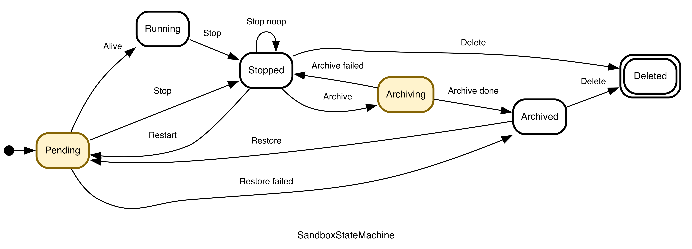

# 沙箱生命周期与状态转移控制

ROCK 将每个沙箱的生命周期持久化为状态机，让用户操作、运行时观测、自动过期、归档恢复和资源清理都经过同一条经过校验的转换路径。

本页所说的 `state` 是 ROCK 写入元数据存储的生命周期状态，也就是 `Sandbox.get_status()` 返回结果中的 `state` 字段；它用于判断沙箱当前所处阶段，以及 `stop`、`restart`、`archive`、`delete` 等操作是否合法。运行时后端返回的是沙箱当前运行情况的实时观测，短时间内可能与持久化 `state` 不一致；ROCK 会通过状态查询和协调器使二者逐步收敛。`Sandbox.get_status()` 返回结果中的 `status` 和 `phases` 记录镜像拉取、沙箱创建、启动或归档等子步骤及错误信息，主要用于展示进度和排障，不是独立的生命周期状态。

## 1. 状态模型

| 状态 | 含义 | 沙箱是否可用 |
| --- | --- | --- |
| `pending` | 新建、重启或归档恢复已提交，正在等待就绪。 | 否 |
| `running` | ROCK 已确认沙箱启动完成，可以正常执行命令和访问服务。 | 是 |
| `stopped` | 沙箱已停止；元数据以及后端支持时的本地沙箱实例仍保留。 | 否 |
| `archiving` | ROCK 正在异步保存沙箱容器的 `rootfs` 和日志目录。 | 否 |
| `archived` | 远端归档产物已就绪；ROCK 会释放本地运行时资源。 | 否 |
| `deleted` | 终态软删除。运行时和适用的归档产物已清理，数据库记录仍保留用于审计。 | 否 |



非法转换会直接报错，不会被静默忽略。两个有意设计的幂等场景是：再次停止已经处于 `stopped` 的沙箱，以及删除不存在或已经删除的沙箱。

## 2. 用户操作与转换规则

| API | 允许的源状态 | 结果 | 关键行为 |
| --- | --- | --- | --- |
| `Sandbox.start()` | 新沙箱 | `pending`，随后 `running` | 就绪前先持久化创建时间、完整请求规格和过期元数据。 |
| `Sandbox.stop()` | `pending` 或 `running` | `stopped` | 始终记录 `stop_time`；对 `stopped` 再次停止是空操作。启用 `remove_container`/`--rm` 的沙箱会立即继续转为 `deleted`。 |
| `Sandbox.restart()` | `stopped` 或 `archived` | `pending`，随后 `running` | 源状态为 `stopped` 时，恢复保存的规格，在原主机启动原沙箱实例、清理旧 phases 并重置过期时间；缺少原主机信息时拒绝重启。源状态为 `archived` 时，自动取回归档目录和镜像并重新调度；失败或超时回到 `archived`。 |
| `Sandbox.archive()` | `stopped` | `archiving`，随后 `archived` | 异步操作；必须启用归档，并同时配置镜像仓库和目录存储凭据。失败或超时回到 `stopped`。 |
| `Sandbox.delete()` | `stopped` 或 `archived` | `deleted` | 删除 Worker 上的沙箱容器；对于已归档沙箱，还会删除远端目录存储和镜像仓库中的相关归档产物。运行中的沙箱必须先停止。 |

如果以后可能还需要沙箱，不要用 `delete()` 代替 `stop()`。`deleted` 是终态：ROCK 会删除 Worker 上的沙箱容器；对于已归档沙箱，还会删除远端目录存储中的日志归档和镜像仓库中的 `rootfs` 归档，之后无法再恢复。

## 3. 观测完整生命周期

为保持向后兼容，不带参数的 `get_status()` 只暴露 `pending` 和 `running`；停止及之后的状态会表现为“未找到”。要查询 `stopped`、`archiving`、`archived` 或 `deleted`，必须调用 `get_status(include_all_states=True)`：

```python
status = await sandbox.get_status(include_all_states=True)

print(status.state)          # pending/running/stopped/archiving/archived/deleted
print(status.create_time)        # 沙箱创建时间
print(status.start_time)         # 沙箱首次启动完成的时间
print(status.stop_time)          # 沙箱最近一次停止的时间
print(status.auto_stop_time)     # 下一次计划自动停止沙箱的绝对时间
print(status.auto_archive_time)  # 下一次计划自动归档沙箱的绝对时间
print(status.auto_delete_time)   # 下一次计划自动删除沙箱的绝对时间

for transition in status.state_history:
    print(
        transition["timestamp"],
        transition["from_state"],
        "--", transition["event"], "-->",
        transition["to_state"],
    )
```

`Sandbox.get_status()` 返回结果的 `status.state_history` 字段记录状态转换历史。每次非自转换都会写入 `from_state`、`to_state`、`event` 和 ISO 8601 时间戳，每个沙箱最多保留最近 100 条记录。`auto_stop_time`、`auto_archive_time` 和 `auto_delete_time` 返回当前有效策略对应的绝对时间；不适用于当前状态的字段为 `None`。启动 `status`/`phases` 仍是诊断细节，不是额外的生命周期状态。

## 4. 自动生命周期控制

生命周期自动化包含以下四种场景。先找到对应场景，再看用户参数与集群配置的关系：

| 自动生命周期场景 | 用户参数（SDK `SandboxConfig` 中设置） | 对应集群配置参数 |
| --- | --- | --- |
| `pending` / `running` 沙箱的自动 `stop` | `auto_clear_seconds` | `lifecycle.auto_transition.auto_clear_seconds` 仅在请求未提供自动停止时间时兜底 |
| `stopped` 沙箱的自动 `archive` | `auto_archive_seconds` | `lifecycle.auto_transition.auto_delete_seconds` 限制用户归档延迟，并用于归档失败后的删除宽限期 |
| `stopped` 沙箱的自动 `delete` | `auto_delete_seconds` | `lifecycle.auto_transition.auto_delete_seconds` 在用户未设置时提供默认删除延迟，并限制用户删除延迟 |
| `archived` 沙箱的自动 `delete` | 无用户参数 | `lifecycle.auto_transition.auto_delete_archived_seconds` |

### 4.1 `Sandbox.start()` 可设置的相关参数

这些参数写在 `SandboxConfig` 中，并在 `Sandbox.start()` 时提交：

| SDK 参数 | SDK 默认值 | 用户可见语义 | 与集群配置的关系 |
| --- | --- | --- | --- |
| `startup_timeout` | `180`，可由环境变量 `ROCK_SANDBOX_STARTUP_TIMEOUT_SECONDS` 修改 | 启动超时时间，单位为秒。SDK 将它提交给服务端，同时也用它限制本地 `start()` 等待沙箱就绪的时间。 | 服务端先采用请求值，再将其限制在集群的最小值与最大值之间。服务端调整后的值不会回写 SDK，因此 SDK 的本地等待时间仍是用户传入的值。 |
| `auto_clear_seconds` | `300` | `pending`/`running` 期间的空闲超时；到期后进入 `stopped`。状态活动会刷新超时。SDK 会将秒数向上取整为整分钟后提交。 | Python SDK 默认会显式提交 `300`，因此通常覆盖集群 `auto_clear_seconds`；只有请求未提供自动停止时间时才使用集群值。 |
| `auto_archive_seconds` | `None` | 从真正进入 `stopped` 开始计时；`None` 表示不自动归档，`0` 表示立即安排归档，正整数表示等待对应秒数。 | 与用户 `auto_delete_seconds` 互斥；若集群 `auto_transition.auto_delete_seconds` 非 `None`，实际延迟取用户 `auto_archive_seconds` 与该集群值中的较小值。自动归档还要求集群启用并配置归档存储。 |
| `auto_delete_seconds` | `None` | 未选择自动归档时，从真正进入 `stopped` 开始计时；`0` 表示立即删除，正整数表示等待对应秒数。 | 若为 `None` 且未设置归档，则继承集群 `auto_delete_seconds`；若用户和集群均有值，实际延迟为两者较小值。 |

`auto_archive_seconds` 和 `auto_delete_seconds` 只接受非负整数。Python SDK 会拒绝同时设置二者：

```python
from rock.sdk.sandbox.client import Sandbox
from rock.sdk.sandbox.config import SandboxConfig

# 示例一：空闲 30 分钟后停止，停止 1 天后归档。
archive_sandbox = Sandbox(
    SandboxConfig(
        image="python:3.11",
        auto_clear_seconds=30 * 60,
        auto_archive_seconds=24 * 60 * 60,
    )
)
await archive_sandbox.start()

# 示例二：30 分钟后自动停止，停止 7 天后删除。不能再设置 auto_archive_seconds。
delete_sandbox = Sandbox(
    SandboxConfig(
        image="python:3.11",
        auto_clear_seconds=30 * 60,
        auto_delete_seconds=7 * 24 * 60 * 60,
    )
)
await delete_sandbox.start()
```

### 4.2 集群参数

管理员通过 `lifecycle` 设置启动超时、自动状态转换和归档策略：

```yaml
lifecycle:
  # 快速收敛 pending 和 archiving 状态。
  reconcile_interval_seconds: 30

  # 客户端未提供 startup_timeout 时使用。
  default_startup_timeout_seconds: 600

  # startup_timeout 的集群下限；客户端传入更小的值时提升到此值。
  min_startup_timeout_seconds: 600

  # startup_timeout 的集群上限；客户端传入更大的值时截断到此值。
  max_startup_timeout_seconds: 1800

  auto_transition:
    interval_seconds: 180
    auto_clear_seconds: 1800
    auto_delete_seconds: null
    auto_delete_archived_seconds: null

  archive:
    enabled: false
    # null 允许所有 key；列表则按 X-Key 限制归档请求。
    allowed_keys: null
    archive_timeout_seconds: 1800
    restore_timeout_seconds: 1800
    max_image_push_size: 16g
    max_dir_upload_size: 16g
    dir_storage:
      type: oss
      endpoint: ""
      bucket: ""
      access_key_id: ""
      access_key_secret: ""
      region: ""
      prefix: rock-archives/
    registry:
      registry_url: ""
      username: ""
      password: ""
      namespace: sandbox_archive
```

| 集群参数（`lifecycle` 下的相对路径） | 默认值 | 完整作用 |
| --- | --- | --- |
| `reconcile_interval_seconds` | `30` | 主 Admin 服务实例检查过渡状态的周期，单位为秒：推动已就绪的 `pending → running`、确认归档结果，并处理归档或恢复超时。它不负责扫描下方基于 deadline 的自动停止、归档和删除。 |
| `default_startup_timeout_seconds` | `600` | 启动请求未提供 `startup_timeout` 时使用的服务端默认值。该时间预算覆盖镜像拉取和运行时启动；普通 SDK 会显式提交自己的默认值，因此通常不会使用此项。 |
| `min_startup_timeout_seconds` | `600` | 服务端启动超时的下限。请求值或默认值小于此值时，服务端将其提升到此值。 |
| `max_startup_timeout_seconds` | `1800` | 服务端启动超时的上限。请求值或默认值大于此值时，服务端将其截断到此值。 |
| `auto_transition.interval_seconds` | `180` | 主 Admin 服务实例扫描已到期自动动作的间隔。实际执行可能比 deadline 晚一个扫描周期，再加上同一轮较早任务的耗时。 |
| `auto_transition.auto_clear_seconds` | `1800` | 启动请求未提供自动停止时间时的默认值。普通 Python SDK 会提交自己的 `auto_clear_seconds`，因此通常不会使用该兜底。 |
| `auto_transition.auto_delete_seconds` | `None` | ① 用户未设置归档或删除时的默认 `stopped → deleted` 延迟；<br />② 用户 `auto_archive_seconds`/`auto_delete_seconds` 的延迟上限，超过时截断为集群 `auto_transition.auto_delete_seconds`，而不是拒绝启动；<br />③ 归档失败或超时后的删除宽限期。<br />`None` 表示三项均不启用。 |
| `auto_transition.auto_delete_archived_seconds` | `None` | 进入或重新进入 `archived` 后的归档保留期。`None` 表示无限期保留，`0` 表示立即安排删除，正整数表示保留对应秒数。这是集群级配置；当前 SDK 的 `SandboxConfig` 不提供对应参数，用户无法在 `Sandbox.start()` 时指定归档保留期。 |
| `archive.enabled` | `false` | 是否启用归档和恢复能力。用户设置 `auto_archive_seconds` 前，集群必须启用并正确配置归档存储。 |
| `archive.allowed_keys` | `None` | 可使用归档能力的 `X-Key` 列表。`None` 表示不按 key 限制；列表表示只有匹配的 key 可以请求归档。 |
| `archive.archive_timeout_seconds` | `1800` | 单次归档的超时时间，单位为秒。超过后，协调循环将本次归档标记为失败并使沙箱回到 `stopped`。 |
| `archive.restore_timeout_seconds` | `1800` | 已归档沙箱通过 `Sandbox.restart()` 恢复时的服务端总超时，覆盖拉取归档镜像、下载 log 目录、重新创建并启动沙箱，以及等待沙箱可用。超过后，本次恢复失败，沙箱回到 `archived`。服务端仍会在恢复的启动阶段另外应用该沙箱已保存的 `startup_timeout`。 |
| `archive.max_image_push_size` | `16g` | 允许推送到镜像仓库的归档镜像大小上限，例如 `16g`；超限会使归档失败。空字符串表示不检查此上限。 |
| `archive.max_dir_upload_size` | `16g` | 允许上传到目录存储的沙箱归档目录大小上限，例如 `16g`；超限会使归档失败。空字符串表示不检查此上限。 |

服务端启动超时的计算方式是：先取请求中的 `startup_timeout`，未提供时取 `lifecycle.default_startup_timeout_seconds`，然后依次应用最小值和最大值限制。

恢复已归档沙箱时，共有三层超时：

- **服务端恢复总超时**：`archive.restore_timeout_seconds` 限制从远端取回归档到沙箱恢复可用的完整流程。
- **服务端启动超时**：沙箱创建时，服务端会保存经 `default_startup_timeout_seconds`、`min_startup_timeout_seconds` 和 `max_startup_timeout_seconds` 处理后的 `startup_timeout`。恢复时，服务端使用这个已保存的值限制重新创建并启动沙箱后的存活检查。完整恢复必须同时满足恢复总超时和服务端启动超时。
- **SDK 本地等待超时**：当前调用方使用其 `SandboxConfig.startup_timeout` 限制 `Sandbox.restart()` 在本地等待沙箱可用的时间。服务端调整后的 `startup_timeout` 不会回写 SDK，因此它可能与服务端保存的值不同。

如果 SDK 本地等待先超时，`Sandbox.restart()` 会在客户端报错，但不会取消服务端恢复。服务端仍按自己的恢复总超时和启动超时执行。默认情况下，SDK 的 `startup_timeout` 是 180 秒，服务端会将启动请求中的该值提升到默认集群下限 600 秒，而 `archive.restore_timeout_seconds` 是 1800 秒。因此，客户端可能先于服务端报超时；需要同步等待较慢的归档恢复时，应为 SDK 配置足够长的 `startup_timeout`。

集群级 `auto_archive_seconds` 已删除。旧静态 YAML 中如仍包含该字段，启动时会因未知参数失败，升级前必须清理。

### 4.3 `None`、`0` 和正整数分别表示什么

| 参数 | `None` | `0` | 正整数 |
| --- | --- | --- | --- |
| 用户 `auto_archive_seconds` | 不选择自动归档 | 停止后立即安排归档 | 停止后等待该值对应的秒数再归档 |
| 用户 `auto_delete_seconds` | 未设置归档时继承集群 `auto_transition.auto_delete_seconds` | 停止后立即删除 | 停止后等待该值对应的秒数再删除 |
| 集群 `auto_transition.auto_delete_seconds` | 无默认停止后删除、无用户延迟上限、归档失败后也不自动删除 | 默认立即删除，并把用户归档/删除延迟限制为 `0` | 默认等待该值对应的秒数再删除，把用户延迟限制为不超过该值，并将该值用作归档失败后的删除宽限期 |
| 集群 `auto_transition.auto_delete_archived_seconds` | 归档无限期保留 | 归档后立即安排删除 | 归档成功或恢复失败后保留该值对应的秒数 |

“立即安排”表示 deadline 是当前时间。扫描型动作仍由后台循环执行，因此可能延迟最多一个 `interval_seconds` 周期；`auto_delete_seconds=0` 时，启用 `--rm` 的沙箱还可能在停止时直接进入 `deleted`。

### 4.4 用户参数与集群参数的优先级

以下矩阵覆盖所有 `stopped` 阶段组合：

| 用户 `auto_archive_seconds` | 用户 `auto_delete_seconds` | 集群 `auto_transition.auto_delete_seconds` | `stopped` 后动作 | 实际延迟 |
| --- | --- | --- | --- | --- |
| 已设置 | `None` | `None` | 归档 | 用户 `auto_archive_seconds` |
| 已设置 | `None` | `0` 或正整数 | 归档 | 用户 `auto_archive_seconds` 与集群 `auto_transition.auto_delete_seconds` 的较小值 |
| `None` | 已设置 | `None` | 删除 | 用户 `auto_delete_seconds` |
| `None` | 已设置 | `0` 或正整数 | 删除 | 用户 `auto_delete_seconds` 与集群 `auto_transition.auto_delete_seconds` 的较小值 |
| `None` | `None` | `None` | 不自动归档或删除 | 无 deadline |
| `None` | `None` | `0` 或正整数 | 删除 | 集群 `auto_transition.auto_delete_seconds` |

Python SDK 不允许同时设置用户 `auto_archive_seconds` 和 `auto_delete_seconds`。如果直接 HTTP 调用仍同时发送二者，服务端以归档为准：集群 `auto_transition.auto_delete_seconds` 为 `None` 时使用用户 `auto_archive_seconds`；否则取用户 `auto_archive_seconds` 与集群 `auto_transition.auto_delete_seconds` 的较小值。用户 `auto_delete_seconds` 不参与实际策略，但原始请求值仍保存在 `spec` 中。

一旦进入 `archived`，用户 `auto_archive_seconds`、用户 `auto_delete_seconds` 和集群 `auto_transition.auto_delete_seconds` 都不再决定归档保留期；只有集群 `auto_transition.auto_delete_archived_seconds` 生效。当前 SDK 的 `SandboxConfig` 不提供对应参数，用户无法在 `Sandbox.start()` 时指定该保留期。

### 4.5 状态变化时如何生成 deadline

ROCK 将相对秒数固化为数据库中的绝对时间。之后修改集群配置，不会追溯改变已经生成的 `stopped` 或 `archived` deadline。

| 事件 | 下一动作与 deadline | 状态接口中的字段 |
| --- | --- | --- |
| 创建后处于 `pending`/`running` | 根据有效 `auto_clear_seconds` 计算自动停止时间；活动状态查询会刷新它 | `auto_stop_time` |
| 首次进入 `stopped`，有效策略为归档 | `archived`，时间为 `stop_time + 有效 auto_archive_seconds` | `auto_archive_time` |
| 首次进入 `stopped`，有效策略为删除 | `deleted`，时间为 `stop_time + 有效 auto_delete_seconds` | `auto_delete_time` |
| 对 `stopped` 再次调用 `stop()` | `stop_noop`，不重新计算 deadline | 保持原值 |
| 归档成功进入 `archived` | 集群 `auto_transition.auto_delete_archived_seconds` 为 `None` 时无下一动作；否则从 `archive_time` 起等待该值对应的秒数再删除 | `auto_delete_time` 或 `None` |
| 归档失败或超时回到 `stopped` | 集群 `auto_transition.auto_delete_seconds` 为 `None` 时不自动删除；否则从失败时刻起等待该值对应的秒数再删除 | `auto_delete_time` 或 `None` |
| 重启 `stopped` 或恢复 `archived` | 进入 `pending` 时清除旧 deadline；下一次真正停止时重新计算 | 旧的归档/删除时间变为 `None` |
| 恢复失败或超时回到 `archived` | 按集群 `auto_transition.auto_delete_archived_seconds` 从失败时刻重新计算；该值为 `None` 时无限期保留 | `auto_delete_time` 或 `None` |
| 进入 `deleted` | 清除自动转换和自动停止时间 | 三个自动时间均为 `None` |

### 4.6 后台执行与运维注意事项

ROCK 主 Admin 服务实例运行两个禁止并发重入、会合并错过调度的循环：

- **协调器（reconciler）** 检查 `pending` 和 `archiving`，推进成功状态，并处理归档/恢复失败或超时。
- **自动转换扫描**依次执行自动停止、删除已停止沙箱、归档已停止沙箱、删除已归档沙箱。每种动作单次最多处理 1000 条，按最早 deadline 优先。

执行是 at-least-once 语义。主 Admin 服务实例暂时不可用时，deadline 会保留在数据库中；该服务实例恢复后，ROCK 会继续处理。

:::warning
使用 deadline 生命周期管理的集群应关闭 `ContainerCleanupTask`。该任务只按 Docker 时间清理已退出的沙箱容器，不读取 ROCK 状态或 deadline，可能在自动归档前删除本地沙箱容器，而且不会同步更新数据库状态。
:::

## 5. 归档与恢复的失败行为

`archive()` 返回并不表示归档已经完成，应等待持久化状态变为 `archived`：

```python
import asyncio

await sandbox.stop()
await sandbox.archive()

while True:
    status = await sandbox.get_status(include_all_states=True)
    if status.state == "archived":
        break
    if status.state == "stopped":
        raise RuntimeError("归档失败或超时，可以重试")
    await asyncio.sleep(3)

# restart() 会识别 archived 并自动执行恢复。
await sandbox.restart()
```

协调器会检查远端归档阶段：成功时执行 `archiving → archived`；远端报告失败或超过 `archive_timeout_seconds` 时回到 `stopped`。恢复期间，`archive_time` 用于区分归档恢复与普通重启；若未能在 `restore_timeout_seconds` 内存活，ROCK 会回到 `archived`，保留远端恢复点以便再次尝试。

归档失败或超时后，ROCK 不会自动再次归档。如果集群配置了 `auto_transition.auto_delete_seconds`，ROCK 会把下一次自动转换设置为 `deleted`，删除时间为“归档失败时间 + `auto_transition.auto_delete_seconds`”；如果该参数为 `None`，则不设置下一次自动转换，沙箱停留在 `stopped`。在自动删除执行前，用户仍可手动再次调用 `Sandbox.archive()`。

从 `archived` 调用 `Sandbox.restart()` 后，沙箱会先进入 `pending`。恢复过程中发生不可恢复错误，或未能在 `archive.restore_timeout_seconds` 内恢复可用时，ROCK 会将沙箱重新置为 `archived`，并保留远端归档，以便再次调用 `Sandbox.restart()`。如果集群配置了 `auto_transition.auto_delete_archived_seconds`，ROCK 会从恢复失败时刻重新计算下一次自动删除时间；`None` 表示不自动删除，`0` 表示立即安排删除，正整数表示等待对应秒数后删除。

## 6. Operator 后端支持情况

下表从用户调用的 Sandbox SDK 接口出发，按 ROCK 1.11 中各个 Operator 的实际能力标注。“支持”表示 Operator 会在后端执行对应操作，而不只是 ROCK 数据库中存在相应状态：

| Operator 后端 | `Sandbox.start()` / `Sandbox.get_status()` | `Sandbox.stop()` | `Sandbox.restart()`（`stopped`） | `Sandbox.archive()` / `Sandbox.restart()`（`archived`） | `Sandbox.delete()` |
| --- | --- | --- | --- | --- | --- |
| Ray | 支持 | 支持 | 支持 | 支持 | 支持 |
| Kubernetes | 支持 | 支持，但会删除 `BatchSandbox` 资源 | 不支持 | 不支持 | 不支持 |
| OpenSandbox | 支持 | 不支持 | 不支持 | 不支持 | 支持 |

因此，依赖 `stopped → pending` 重启或 `stopped → archiving → archived` 归档的流程目前只能使用 Ray Operator。Kubernetes 的 `stop` 等同于删除后端工作负载；OpenSandbox 如需结束沙箱，应直接使用 `delete`。

## 相关文档

- [用户配置](configuration.md)
- [Python SDK 文档](../References/Python%20SDK%20References/python_sdk.md)
- [API 文档](../References/api.md)
