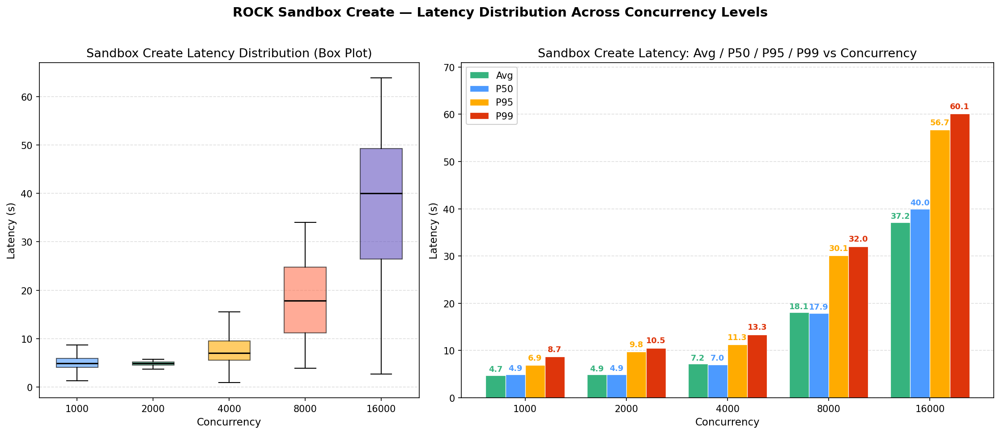

# ROCK Sandbox 大规模并发创建压测报告

## 1. 测试背景

在 Agentic 强化学习训练以及大规模 Agent Rollout 场景中，**单个训练 step 往往需要同时拉起成千上万个 Sandbox**，因此 Sandbox 的并发创建吞吐与延迟直接决定了整体训练效率。

本报告分别在 1000 / 2000 / 4000 / 8000 / 16000 并发规模下完成 Sandbox 批量创建压测，验证 ROCK 在大规模并发下的稳定性与延迟表现。

## 2. 测试范围与口径

- **被测对象**：ROCK Sandbox 的创建链路。
- **统计指标**：单个 Sandbox 从发起创建请求到 Sandbox 处于存活（可用）状态的端到端耗时（秒）。
- **并发规模**：1000、2000、4000、8000、16000 个 Sandbox 同时发起创建。
- **并发模型**：采用 **多机分布式 + 纯多进程** 的方式驱动并发——由多台机器同时发压，每台机器内部以独立 OS 进程承载每个 Sandbox 创建任务，避免单进程内 GIL、事件循环、TLS 握手等成为客户端侧瓶颈，使数据真实反映服务端的处理能力。

## 3. 测试结果

### 3.1 Sandbox 创建耗时统计

| 并发规模 | 样本数 | 成功率 | 最小值 | 最大值 | 平均值 | P50 | P95 | P99 |
|---:|---:|---:|---:|---:|---:|---:|---:|---:|
| **1000** | 1000 | 100% | 0.47s | 9.84s | 4.72s | 4.93s | 6.89s | 8.69s |
| **2000** | 2000 | 100% | 0.64s | 11.20s | 4.90s | 4.92s | 9.76s | 10.53s |
| **4000** | 4000 | 100% | 0.93s | 15.51s | 7.16s | 7.05s | 11.26s | 13.34s |
| **8000** | 8000 | 100% | 3.85s | 33.99s | 18.06s | 17.86s | 30.09s | 32.03s |
| **16000** | 16000 | 100% | 2.66s | 63.84s | 37.17s | 39.98s | 56.68s | 60.11s |

> 时间单位均为秒（s）。所有规模下成功率均为 **100%**（0 失败）。
>
> 说明：随着并发规模的增大，为保护服务端稳定性，ROCK 会在控制面侧进行限流，因此耗时随并发上升而有所增加。

## 4. 结论

ROCK 在 1000 至 16000 并发规模下完成的 Sandbox 批量创建压测取得了以下结果：

1. **100% 成功率**，验证了 ROCK 在大规模并发下的可靠性。
2. **小规模并发（≤2000）几乎无排队**，P50 稳定在 5s 以内，可以满足绝大多数实时性敏感的训练 / 评估场景。
3. **大规模并发（≥4000）延迟随并发数近似线性增长**，行为可预测，便于按 Sandbox 池规模做容量规划。
4. **16000 并发场景下 P99 仍可控制在 60s 量级**，足以支撑超大规模 Agent Rollout 与并行 RL Step 等任务。

ROCK 已经具备承载 **万级并发 Sandbox 创建** 的能力，为大规模 Agentic RL 训练提供了坚实的环境基础设施。
